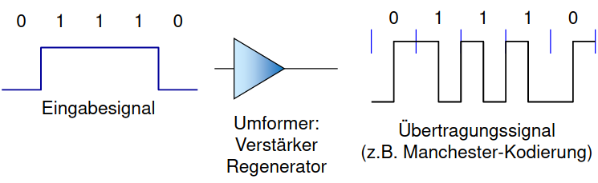

# Basisbandübertragung

**Unterscheidung:** Zweiwertige vs. mehrwertige Signale

- Einfachste Form der Übertragung
- Anpassung an Mediencharakteristik
- [[Abbildungsvorschrift]] codiert Daten für Übertragung (siehe [[Leitungscodes]])
   
- **Schritt:** Minimales Zeitintervall $T_{min}$ zwischen Signaländerungen (auch _Schrittdauer_ genannt)
- **Schrittgeschwindigkeit:** $1 / T_{min}$ in [[Baud]] ($1/s$)
   
- Fehlerquelle: Fehlerhafte [[Synchronisation]]

[//begin]: # "Autogenerated link references for markdown compatibility"
[Leitungscodes]: Leitungscodes "Leitungscodes"
[//end]: # "Autogenerated link references"