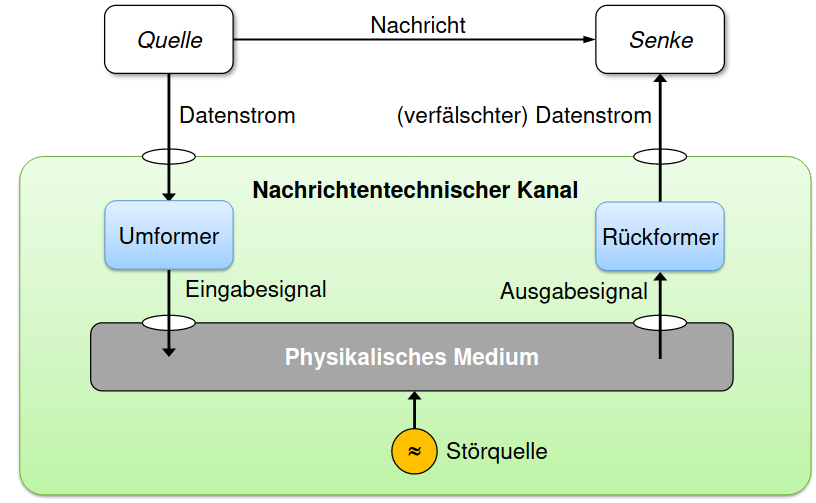

# Bitübertragungsschicht

- Physikalisches Medium ist **störanfällig** (siehe [[Fehlertypen]] & [[Fehlerquellen]])
- Agnostisch ob [[Digitale Übertragung]] oder [[Analoge Übertragung]] (siehe [[Signaltypen]] & [[Physikalische Medien]])
- Basiert auf [[Rechteckschwingung]]
- Nutzt immer nur bestimmte [[Bandbreite]] des Mediums
- Nyquist- und Shannon-Theorem: #todo

[//begin]: # "Autogenerated link references for markdown compatibility"
[fehlertypen]: Fehlertypen "Fehlertypen"
[fehlerquellen]: Fehlerquellen "Fehlerquellen"
[digitale übertragung]: <Digitale Übertragung> "Digitale Übertragung"
[analoge übertragung]: <Analoge Übertragung> "Analoge Übertragung"
[signaltypen]: Signaltypen "Signaltypen"
[physikalische medien]: <Physikalische Medien> "Physikalische Medien"
[rechteckschwingung]: Rechteckschwingung "Rechteckschwingung"
[bandbreite]: Bandbreite "Bandbreite"
[//end]: # "Autogenerated link references"
