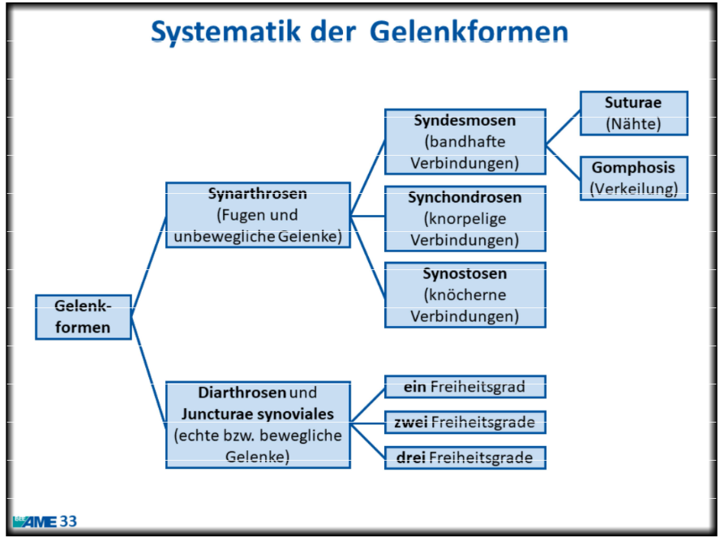

# Gelenkformen

- Synarthrosen (Fugen & unbewegliche Gelenke)
  - Syndesmosen ([[Bänder|bandhafte]] Verbindungen)
    - Suturae (Nähte) - Bsp: [[Sutura serrata]], [[Sutura squamosa]], [[Sutura plana]]
    - Gomphosis (Verkeilung) - Bsp: [[Zahnalveolen]]
  - Synchondrosen ([[Knorpel|knorpelige]] Verbindungen) - Bsp: [[Hyaliner Knorpel]], [[Faserknorpel]]
  - Synostosen ([[Knochen|knöcherne]] Verbindungen) - Bsp: [[Kreuzbein]]
- Diarthrosen und Juncturae synoviales (echte bzw. bewegliche Gelenke)
  - **ein** Freiheitsgrad - Bsp: [[Scharniergelenk]], [[Schraubengelenk]], [[Drehgelenk]] (Zwischen Elle & Speiche)
  - **zwei** Freiheitsgrade - Bsp: [[Ellipsoidgelenk]], [[Sattelgelenk]]
  - **drei** Freiheitsgrade - Bsp: [[Kugelgelenk]], [[Nussgelenk]] (Hüfte)
  - **fünft** Freiheitsgrade: [[Kniegelenk]]

<small>**Anmerkung:** Alles auswendig. Ja geil.</small>
