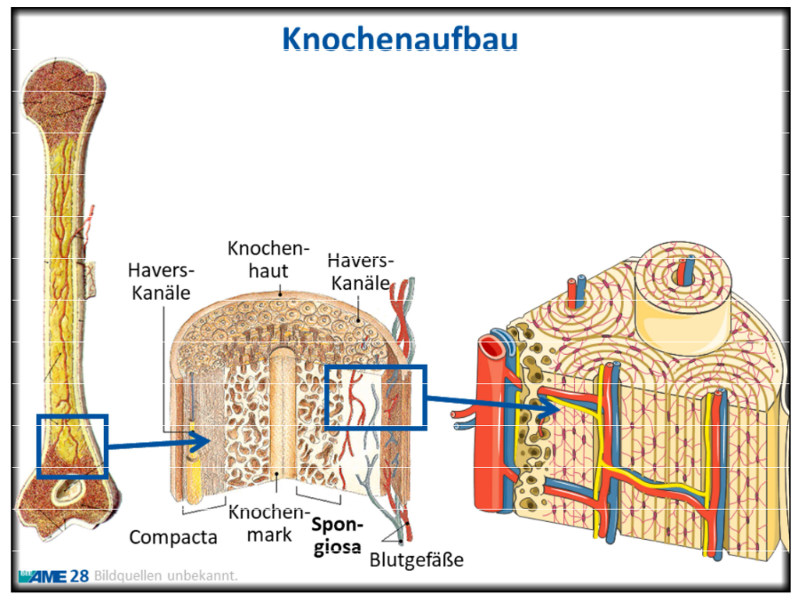

# Knochenaufbau

Oberflächenstrukturen:

- [[Knorpel]] um die [[Gelenke]]
- Gräben: Führungsschienen für [[Sehnen]] und [[Muskeln]]
- Ränder und Rauheiten: Anwachsstellen für [[Sehnen]] und [[Muskeln]]
- [[Knochenmark]]
- [[Spongiosa]] = schwammartige (aber **feste**) Struktur
- [[Kompakta]]: Dichte Knochenmasse
- [[Knochenhaut]]

## Wachstum

Knochen sind lebendes Gewebe! Entwicklung durch Oste**b**lasten ("bauen" Gewebe) und Osteo**c**lasten ("klauen" Gewebe)
