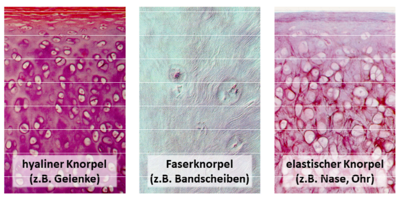

# Knorpel

Unterteilung in drei Typen:

- [[Hyaliner Knorpel]]
- [[Faserknorpel]]
- Elastischer Knorpel

Knorpel ist wenig durchblutet und ernährt sich hauptsächlich durch [[Diffusion]]. Deshalb ist seine Regeneration enorm eingeschränkt.

[//begin]: # "Autogenerated link references for markdown compatibility"
[Hyaliner Knorpel]: <Hyaliner Knorpel> "Hyaliner Knorpel"
[Faserknorpel]: Faserknorpel "Faserknorpel"
[//end]: # "Autogenerated link references"