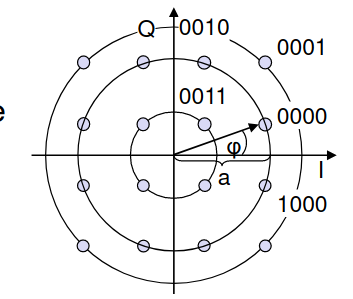

# Quadraturamplitudenmodulation (QAM)

- Kombination [[Amplitudenmodulation]] und [[Phasenmodulation]]
- Kodiert $n$ Module in einem Taktschritt
- $2^n$ diskrete Signalwerte
- Fehlerrate wächst mit $n$, aber trotzdem recht gering
- Angewandt z.B. in DSL, WLAN, LTE, DVB-S
   
  
  <small>Ringe = Amplitude, Winkel = Phase</small>

[//begin]: # "Autogenerated link references for markdown compatibility"
[Amplitudenmodulation]: Amplitudenmodulation "Amplitudenmodulation"
[Phasenmodulation]: Phasenmodulation "Phasenmodulation"
[//end]: # "Autogenerated link references"
