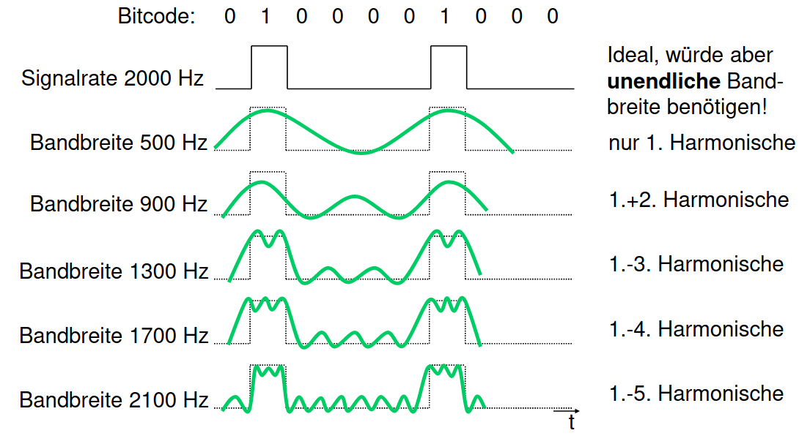

# Rechteckschwingung

Approximiert mit [[Periodische Signale|periodischen Signalen]]

[//begin]: # "Autogenerated link references for markdown compatibility"
[Periodische Signale|periodischen Signalen]: <Periodische Signale> "Periodische Signale"
[//end]: # "Autogenerated link references"