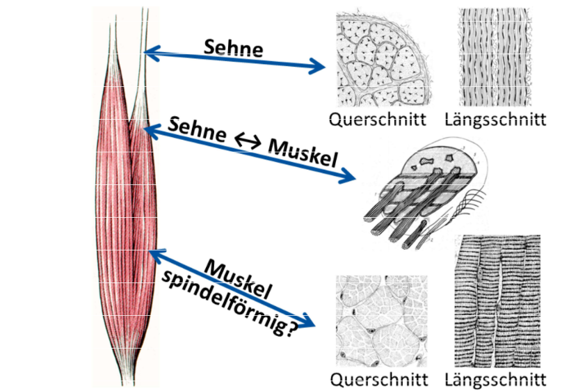

# Skelettmuskel

Fast immer [[Quergestreifter Muskel]], also willentlich kontrollierbar

## Aufbau

- [[Sehne]]: Zugfeste Struktur, Verbindung Knochen <-> Sehne
- Übergang [[Sehne]]-[[Muskel]]: Allmählich, Fasern verwachsen
- Muskelgewebe: Nur aktive Verkürzung, Streckung durch [[Antagonist|Antagonisten]]
