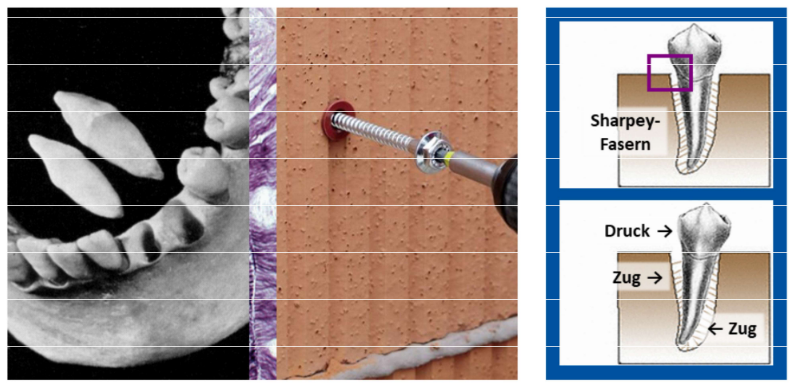

# Zahnalveolen

<small>Beachte: Metapher zur Schraube bezieht sich auf das elastische Bindematerial (Dübel/Sharpey-Fasern), nicht das Gewinde</small>

Zähne sind über kurze, elastische und gebündelte Fasern (Bündel wird Sharpey-Faser genannt) im Kiefer aufgehangen - dies erhöht ihre Widerstandsfähigkeit bei Extrembelastungen.
